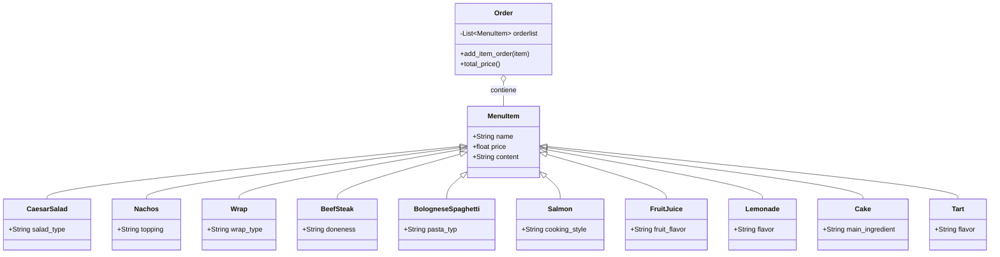

# Reto #03 de POO
Entrega del tercer reto planteado por Felipe Gonzales Roldan para programacion orientada objetos en la Universidad Nacional de Colombia
## Codigo Planteado
```python
class MenuItem:
    def __init__(self, name: str, price: float, content: str):   
        self.name = name
        self.price = price
        self.content = content 

class CaesarSalad(MenuItem):
    def __init__(self, salad_type: str):
        super().__init__("Caesar Salad", 15000, "Lettuce, croutons, Parmesan cheese, Caesar dressing")
        self.salad_type = salad_type

class Nachos(MenuItem):
    def __init__(self, topping: str):
        super().__init__("Nachos with a topping", 18000, "Corn chips, topping at client's choice, melted cheese, pico de gallo.")
        self.topping = topping

class Wrap(MenuItem):
    def __init__(self, wrap_type: str):
        super().__init__("Veggie Wrap", 14000, "Tortilla filled with fresh vegetables or steak.")
        self.wrap_type = wrap_type

class BologneseSpaghetti(MenuItem):
    def __init__(self, pasta_type: str):
        super().__init__("Spaghetti Bolognese", 28000, "Spaghetti, beef tomato sauce, onion, garlic, grated cheese.")
        self.pasta_type = pasta_type
        
class BeefSteak(MenuItem):
    def __init__(self, doneness: str):
        super().__init__("Beef Steak", 35000, "Grilled beef steak, served with mashed potatoes and seasonal vegetables.")
        self.doneness = doneness

class Salmon(MenuItem):
    def __init__(self, cooking_style: str):
        super().__init__("Salmon with Rice", 38000, "Salmon cooked at the client's decision, rice, steamed vegetables, lemon.")
        self.cooking_style = cooking_style

class FruitJuice(MenuItem):
    def __init__(self, fruit_flavor: str):
        super().__init__("Juice made with the fruit of the client's choice", 8000, "Fresh juice blended with water and a touch of sugar.")
        self.fruit_flavor = fruit_flavor

class Lemonade(MenuItem):
    def __init__(self, flavor: str):
        super().__init__("Lemonade with a flavor of the client's choice", 9000, "Lemon, mint, water, and sugar.")
        self.flavor = flavor 

class Cake(MenuItem):
    def __init__(self, main_ingredient: str):
        super().__init__("Cake made with the ingredient of the client's choice", 12000, "Base of the cake with the ingredient of the client's choice, cinnamon, nutmeg, cream cheese frosting.")
        self.main_ingredient = main_ingredient

class Tart(MenuItem):
    def __init__(self, flavor: str):
        super().__init__("Tart with the flavor of the client's choice", 14000, "Shortcrust pastry base, flavor of the client's choice, optional meringue or powdered sugar")
        self.flavor = flavor

class Order:
    def __init__(self):
        self.orderlist = []

    def add_item_order(self, item: MenuItem):
        self.orderlist.append(item)
        print(f"{item.name} added to order. Price: {item.price} COP")

    def total_price(self):
        return sum(item.price for item in self.orderlist)


salad = CaesarSalad("Salty Salad")
nachos = Nachos("Guacamole")
spaghetti = BologneseSpaghetti("Spaghetti")

order = Order()

order.add_item_order(salad)
order.add_item_order(nachos)
order.add_item_order(spaghetti)


print("Total price:", order.total_price(), "COP")
```
## Diagrama de clases

